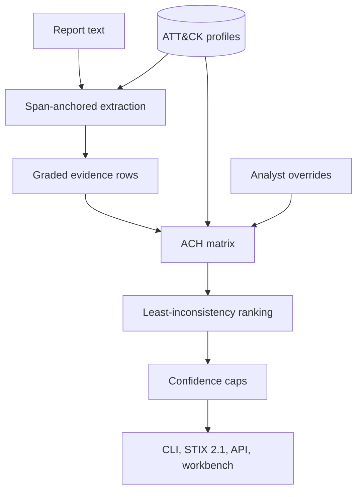

# OCCAM

[](https://github.com/rakshit-737/occam/actions/workflows/ci.yml)
[](https://rakshit-737.github.io/occam/)
[](https://github.com/rakshit-737/occam/releases)

[](LICENSE)


**Auditable attribution for threat intelligence: span-anchored ATT&CK extraction, campaign clustering, and Analysis of Competing Hypotheses that has to consider "unknown actor" and "someone framed X".**

**Contribution.** An open, leakage-controlled benchmark for attack attribution under *planted*, *authentic* and *mimicked* false-flag evidence, and an auditable ACH engine measured on it. On 274 held-out ATT&CK incidents it shows that resisting planted markers comes from typing evidence as spoofable (a baseline that ignores spoofable rows is never framed either), while ACH's least-inconsistency ranking cuts framing under TTP **mimicry** from 76% (TTP-similarity) to 27%, though only 2-9 points below the best simple baseline (IDF coverage, 32%), and removing diagnosticity weighting lowers it further (18%) at a cost in closed-world accuracy, so the mimicry gain is not shown to be specific to ACH's weighting, and declines on untracked actors 46% of the time. The cost: 30% vs 53% closed-world accuracy, and genuine markers are called a frame-up 19% of the time.

[](https://rakshit-737.github.io/occam/demo/)

**Docs:** <https://rakshit-737.github.io/occam/> · **Live demo:** <https://rakshit-737.github.io/occam/demo/> · **Evaluation:** [docs/evaluation.md](docs/evaluation.md) · **Preprint:** [paper/](paper/)

## Research question and answer

*Does automated ACH with mandatory disconfirming-evidence weighting give better-calibrated, less overconfident attribution than naive TTP-similarity matching, especially under false flags?*

Partly. Against the naive, marker-trusting matcher, yes by a wide margin. Against baselines that already ignore spoofable evidence, ACH is **not** better on planted markers; its real gains are against TTP mimicry and in declining when the actor is untracked. It is worse when nobody is lying.

| Question (274 held-out ATT&CK incidents unless noted) | OCCAM ACH | Best simple baseline | Naive TTP-similarity |
| --- | --- | --- | --- |
| Framed group named, 3 planted spoofable markers | 1.1% [0.0-3.0] | **0%** (similarity ignoring spoofable rows) | 88.0% |
| Correct under planted markers (true group named or frame detected) | 73.4% [67-80] | **92.0%** [88-95] (consistency gate, cross-fitted) | 11.3% |
| Genuine markers wrongly called a frame-up | 18.6% | 0% (similarity) / 23% (gate) | 0% |
| Framed group named, **mimicry** of 3 rare TTPs/tools | **27.0%** [21-33] | 32.1% (IDF coverage) | 76.3% |
| Correct "unknown" when the true group is untracked | 46.0% [39-53] (64% with shortlist) | 94.5% (decline below a cosine threshold, but closed-world accuracy drops to 27%) | 0% |
| Closed-world top-1 | 29.9% [23-37] | **53.3%** [45-61] | 53.3% |
| Brier, one setting-agnostic calibration map (closed / open / false flag) | 0.189 / 0.249 / 0.205 | | 0.315 / 0.032 / 0.131 |
| Closed / open / planted vs naive matcher on 575 incidents, 21 campaigns, temporal splits | same direction ([extended](results/attribution_extended.md)); controls and mimicry not re-run there | | |

Brackets are 95% group-cluster bootstrap intervals. Sources: [`results/falseflag.md`](results/falseflag.md), [`results/attribution.md`](results/attribution.md).

## Try it in 60 seconds

**Browser:** open the [live workbench demo](https://rakshit-737.github.io/occam/demo/) and click any matrix cell.

**Docker** (API + workbench on loopback only):

```bash
docker run --rm -p 127.0.0.1:8000:8000 ghcr.io/rakshit-737/occam:latest    # then open http://127.0.0.1:8000/
```

**Python, zero dependencies:**

```bash
git clone --depth 1 https://github.com/rakshit-737/occam && cd occam
python -m pip install -e . && occam demo          # or: python -m occam demo
occam ach false_flag_games                         # one bundled scenario
```

Expected output (abridged):

```text
ASSESSMENT: It is roughly even chance / cannot be determined that: False flag: another actor framed ACTOR-EMBER
CONFIDENCE: LOW
False-flag indicators considered:
  - Markers implicate ACTOR-EMBER, but hard evidence ['E5', 'E6', 'E7', 'E8', 'E9'] contradicts that actor.
```

## How it works



1. **Evidence** rows come from report text (every technique, tool and IOC keeps the source span it came from) or from analysts, with an Admiralty grade. Code overlap, language artefacts, metadata and claims are typed **spoofable**.
2. **Hypotheses**: every candidate actor, plus *unknown actor*, plus *false flag: someone framed X* for every actor a spoofable marker points at.
3. **Cells** CC/C/N/I/II are proposed by rules (rarity measured from ATT&CK usage) and can be overridden by an analyst.
4. **Weights** = Admiralty grade x diagnosticity (rows that rate every hypothesis the same weigh 0); spoofable rows x0.5.
5. **Ranking** by least weighted inconsistency (Heuer), ties to the more conservative conclusion.
6. **Confidence** from margin and diagnostic count, then capped (LOW if support is mostly spoofable; at most MODERATE for deception/unknown conclusions or when planted-marker indicators fire). A leave-one-out pass reports what would change the conclusion.

A step-by-step walkthrough with the matrix is on [How it works](docs/how-it-works.md); design decisions are in [docs/adr/](docs/adr/).

| Module | Role | Extra deps |
| --- | --- | --- |
| `occam/extract.py`, `occam/classifier.py` | Span-anchored IOC/TTP/software extraction; optional TF-IDF + LR sentence classifier | none / `ml` |
| `occam/knowledge.py`, `occam/attack.py` | ATT&CK STIX loader, group profiles, usage-based rarity | none |
| `occam/ach.py` | Hypotheses, cell rating, diagnosticity, ranking, confidence caps, sensitivity; ablation switches | none |
| `occam/attribution.py` | `ACHAttributor` and the similarity / IDF-coverage baselines | none |
| `occam/evaluation.py`, `occam/calibration.py` | Held-out protocols (closed, open, false flag, authentic, mimicry, campaigns, temporal) and calibration | none |
| `occam/graph.py`, `occam/neo4j.py` | Diamond graph, kNN-Louvain campaigns, Cypher export | `graph` |
| `occam/stix.py`, `occam/api.py`, `ui/` | STIX 2.1 export, FastAPI + read-only TAXII 2.1, React workbench | `stix`, `api` |

## Results

All tables are generated by `scripts/bench_*.py` from pinned public data; JSON and Markdown are in [`results/`](results/), and the [Evaluation page](https://rakshit-737.github.io/occam/evaluation/) has every table with its methodology.

**False flags, controls and ablations** ([`results/falseflag.md`](results/falseflag.md)). Removing ACH's false-flag hypotheses leaves the framed-group rate unchanged (1.1%) and raises "names the true group" from 2% to 20%: what blocks planted markers is the least-inconsistency ranking over hard evidence, while the false-flag hypotheses turn outcomes into "framed" conclusions. The confidence caps change none of the accuracy metrics and the x0.5 spoofable discount changes them by under 2 points. Raising the marker count from 1 to 6 moves the naive matcher from 12% to 100% framed; ACH stays at 1% under planted markers and goes from 7% to 44% under mimicry.

**Held-out attribution** ([`results/attribution.md`](results/attribution.md)). Closed / open / false-flag on 274 incidents from 103 groups, with group-cluster CIs, per-setting and setting-agnostic calibration, and 5 framing seeds. The per-setting learned grade map (closed-world Brier 0.156) knows which setting it is in and is an oracle upper bound; the deployable pooled map gives 0.189 (the canonical pooled table; `falseflag.md` reports the same map as one number over all settings, 0.214 ACH vs 0.160 similarity).

**Extended protocols** ([`results/attribution_extended.md`](results/attribution_extended.md)). All 575 report incidents, 21 held-out campaigns, 31 unattributed campaigns, and temporal splits (profiles from ATT&CK v12.1 / v15.1, incidents added later). Against the naive matcher the closed / open / planted pattern is the same (the authentic, mimicry and simple-baseline controls were only run on the 274-incident set); in the temporal splits ACH and similarity are both weak in the closed world (0.21 vs 0.20 for v12.1), and after mapping renamed technique ids back to the old release ACH's correct-decline rate is 0.51 (it was 0.68 before the fix, inflated by unknown ids).

**Reproduction of published TTP extraction (rcATT)** ([`results/rcatt_reproduction.md`](results/rcatt_reproduction.md)). Legoy et al. (2020) report tactic micro F0.5 65.38; the released pipeline reproduces 64.63 on the same 1,490 reports and 5 folds; for 197 techniques the paper reports 35.02 and the released pipeline gives 35.81. The pipeline exactly as described in the paper text (no class weighting) gets 28.30: the gap is the undocumented `class_weight="balanced"`. OCCAM's TF-IDF + LR reaches 34.18 micro but only 12.94 macro F0.5, so it is not better than rcATT on this task.

**TTP extraction on TRAM2** ([`results/extraction.md`](results/extraction.md)). Document micro-F1 0.710 (fold mean ± SD 0.710 ± 0.023) for TF-IDF + LR trained on ATT&CK procedures plus TRAM folds, 0.618 from ATT&CK procedures alone, 0.388 for keywords. Two TRAM labels are revoked in ATT&CK 19.2 (3.3% of gold labels), and some TRAM reports are also cited by ATT&CK procedure examples, so the "ATT&CK only" model is not fully independent of the test reports.

**Campaign clustering** ([`results/clustering.md`](results/clustering.md)). On 270 held-out events from 36 groups, kNN-Louvain ARI 0.249 vs 0.203 for a dense graph tuned the same way and 0.107 for single linkage; on dev the dense graph is as good (0.373 vs 0.369), so the kNN step is not clearly justified.

**End-to-end on 72 APTnotes reports** ([`results/aptnotes.md`](results/aptnotes.md)). Leak-controlled top-1: ACH 0.319 [0.22-0.43] vs similarity 0.264 [0.18-0.38], with 0/72 vs 9/72 answers wrong at p >= 0.8. The top-1 difference (23 vs 19 reports) is not significant: even if all 4 net discordant reports went one way, exact McNemar p = 0.125. The 0/72 is close to guaranteed by construction: ACH's grades are capped (HIGH, 0.875, is rarely reachable and answers are capped at MODERATE, 0.675, whenever deception indicators fire or a same-actor false-flag hypothesis is not rejected), so this metric can barely fail for ACH. Attributing on software names alone does better (similarity 0.47, ACH 0.44), so most of the signal is in tool names.

## Development and real data

```bash
python -m pip install -e ".[dev,pdf,bench]"
python -m pytest -q                       # 80+ tests; real-data tests skip without the datasets
python scripts/download_data.py           # ~400 MB, pinned + checksummed, into ../../datasets/occam or $OCCAM_DATA
D=../../datasets/occam
occam train-classifier --attack $D/enterprise-attack-19.2.json --tram $D/tram/multi_label.json --out model.pkl   # ~26 min, ~340 MB
occam attribute occam/demo/reports/r3_tide_energy.txt --attack $D/enterprise-attack-19.2.json
uvicorn occam.api:app --host 127.0.0.1 --port 8000      # API + workbench; cd ui && npm ci && npm run dev for the React dev server
```

Exact commands, expected numbers and measured runtimes for every benchmark are on the [Reproduce page](docs/reproduce.md).

## Related work

Heuer's ACH (1999) is the method; Steffens (2020) already describes using ACH to reason about planted evidence in APT attribution, and Skopik & Pahi (2020) rate how spoofable each kind of technical artefact is. Rid & Buchanan (2015) frame attribution as a process with stated uncertainty. TTP-based attribution with machine learning (Noor et al., 2019) and report-level TTP extraction (Legoy et al., 2020, rcATT; Orbinato et al., 2022) are the closest automated work. OCCAM does not claim ACH or false-flag reasoning as new ideas: it automates Steffens-style ACH over ATT&CK, and measures it against baselines, controls and ablations. Tools: MISP and OpenCTI store and share intelligence, ATT&CK Navigator visualises it, TRAM and rcATT map text to ATT&CK; OCCAM emits Navigator layers and STIX and can sit beside them. Full references are in [paper/refs.bib](paper/refs.bib).

## Limitations

- **Closed-world accuracy is modest** (30% vs 53%), and the opt-in support-aware ranking that narrows the gap gives up declining.
- **False-flag evidence is synthetic.** Markers and mimicked items are evidence rows, not forged binaries.
- **Genuine overlap is sometimes called a frame-up** (18.6%) and ACH rarely names the true actor behind a detected frame (2%).
- **Incidents are slices of ATT&CK reporting**, not telemetry; APTnotes labels come from file names and the leak control is a title-matching heuristic.
- **The static demo** recomputes the ranking but not the confidence grade (the Python API does both).
- **Not done:** spaCy/LLM extractors, a live Neo4j/OpenCTI load test, a persistent TAXII store, real-world case studies (Olympic Destroyer, WannaCry, NotPetya) built from cited public reporting.

## Safety and ethics

Attribution has diplomatic, legal and human consequences. OCCAM is decision support: every output says it needs human review, and results about real ATT&CK groups are benchmark artefacts, not findings. It reads text and JSON only, never contacts the infrastructure it describes, and never downloads malware. The API binds to 127.0.0.1, rejects foreign Host headers, caps request sizes and supports a bearer token. See [THREAT_MODEL.md](THREAT_MODEL.md), [SECURITY.md](SECURITY.md) and [CONTRIBUTING.md](CONTRIBUTING.md).

## Citation and licence

Cite via [CITATION.cff](CITATION.cff). Code: MIT ([LICENSE](LICENSE)). ATT&CK® IDs and names are © The MITRE Corporation (ATT&CK Terms of Use); TRAM2 data is Apache-2.0 (CTID); rcATT data and preprocessing are MIT (V. Legoy); APTnotes reports are © their publishers and are not redistributed.
