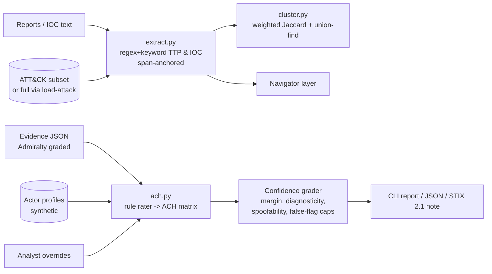

# OCCAM

**Auditable threat-intel reasoning: prose → ATT&CK TTPs → campaigns → Analysis of Competing Hypotheses, with confidence grading that holds up against false flags.**

MISP stores indicators. ATT&CK Navigator paints heatmaps. Neither reasons. OCCAM is a small, dependency-free engine that reads threat reporting and extracts ATT&CK techniques and IOCs, each anchored to the span of source text it came from. It then clusters reports into campaigns and answers attribution questions with a transparent **Heuer ACH matrix**. That matrix always includes *unknown actor* and *false flag* hypotheses, and confidence goes down when the case rests on evidence that is cheap to plant.

> The rules propose and the analyst decides. Every matrix cell can be overridden, and the result is recomputed deterministically.

## Architecture



| Module | Role |
| --- | --- |
| `occam/models.py` | Typed contracts: `Evidence`, `ActorProfile`, `Hypothesis`, `Assessment`, `SourceSpan`, Admiralty weights |
| `occam/attack.py` | Bundled ATT&CK subset (26 techniques, 7 tools). `convert_stix_bundle` imports a local `enterprise-attack.json` |
| `occam/extract.py` | IOC regexes (defang-aware) and technique/tool keyword matching. Every hit carries a `SourceSpan` |
| `occam/cluster.py` | Groups reports into campaigns by shared tools, IOCs, and non-common TTPs |
| `occam/ach.py` | Hypothesis generation, cell rating, diagnosticity, least-inconsistency ranking, confidence caps, sensitivity analysis |
| `occam/stix.py` | STIX 2.1 export with the confidence grade and matrix attached |
| `occam/cli.py` | `extract`, `cluster`, `ach`, `load-attack`, `demo` |

### How the ACH works
1. **Hypotheses.** Each actor profile gets one. Each actor that spoofable markers point at gets a `False flag: someone framed X` hypothesis. `Unknown actor` is always included.
2. **Cells** use CC/C/N/I/II. Hard evidence (tool, infrastructure, TTP, victimology) is rated against each profile. Spoofable evidence (code overlap, language artifacts, metadata, claims) is rated more weakly and supports the matching false-flag hypothesis.
3. **Weight** = Admiralty reliability × credibility × relevance × *diagnosticity* (how much the row's ratings vary across hypotheses). Non-diagnostic rows get 0. Spoofable rows get ×0.5.
4. **Rank** by least weighted inconsistency (Heuer). Support is shown but never used to rank. Ties go to the more conservative hypothesis: unknown, then false flag, then a named actor.
5. **Confidence** starts from the relative margin and the number of diagnostic items. Caps then apply. It drops to LOW if most support is spoofable. It is held at MODERATE or below if the leader is a false-flag or unknown hypothesis, if a same-actor false flag has not been clearly rejected, or if any planted-marker indicators exist.
6. **What would change this.** A leave-one-out pass lists the evidence whose removal would change the leader. It also lists the items the runner-up's rejection depends on.

## Quickstart
```bash
cd occam
python -m pip install -r requirements.txt    # only pytest; runtime is stdlib
make test                                    # or: python -m pytest -q
make demo                                    # or: python -m occam demo

python -m occam extract fixtures/reports/r3_tide_energy.txt --navigator > layer.json
python -m occam cluster fixtures/reports
python -m occam ach fixtures/scenarios/false_flag_games.json
python -m occam ach fixtures/scenarios/clean_attribution.json --override E1:H-QUILL=II --json
python -m occam ach fixtures/scenarios/false_flag_games.json --stix

# Optional full ATT&CK (you download it; never fetched automatically)
python -m occam load-attack enterprise-attack.json --out attack_kb.json
python -m occam --kb attack_kb.json extract report.txt
```

| Demo scenario (synthetic) | Outcome |
| --- | --- |
| `clean_attribution` | ACTOR-QUILL, **HIGH** confidence |
| `false_flag_games` | Follows the public *structure* of the Olympic Destroyer case. Planted code, metadata, and language markers point at EMBER (and one at QUILL), and the hard evidence contradicts both. OCCAM does **not** name EMBER. It leads with a false-flag hypothesis at **LOW** confidence and lists the planted-marker indicators |
| `thin_evidence` | *Unknown actor*, **LOW** |

## Prior art and how OCCAM differs
| Tool | Strength | What OCCAM adds |
| --- | --- | --- |
| MISP | IOC storage and sharing | Reasoning over stored indicators |
| OpenCTI | STIX knowledge graph | Automated, auditable ACH scoring (can sit on top of OpenCTI) |
| ATT&CK Navigator | Visualisation | OCCAM emits Navigator layers and reasons over them |
| PARC ACH / spreadsheets | Manual ACH | Rule-proposed cells, Admiralty weights, diagnosticity, mandatory false-flag and unknown hypotheses, sensitivity analysis |
| Commercial TIPs | Enrichment and scoring | Open, overridable attribution logic |

OCCAM does not claim novelty for STIX, ATT&CK, or IOC handling. Its contribution is the reasoning layer.

## Safety and ethics of attribution
- **Decision support, not a verdict.** Attribution has diplomatic, legal, and human consequences. Every report says it needs human analytic review.
- **Fictional actors only.** EMBER, TIDE, QUILL, and their tools are invented. Do not present OCCAM output about real groups as an attribution finding.
- **Anti-overconfidence by design.** Mandatory unknown and false-flag hypotheses, spoofable-evidence discount, conservative tie-breaks, and confidence caps.
- **No offensive capability.** OCCAM only reads text and JSON. It does no scanning, no fetching, and never contacts infrastructure.

See [THREAT_MODEL.md](THREAT_MODEL.md) and [SECURITY.md](SECURITY.md).

## TODO (not in this MVP; Grade B/C/D/E)
| Item | Grade | Status |
| --- | --- | --- |
| Trained text→technique classifier (e.g. TRAM data) | B/C | TODO. The keyword baseline has limited recall |
| spaCy entity and relationship extraction | B | TODO |
| Optional LLM extraction (must emit span-anchored hits; span-less hits rejected) | B/C | TODO |
| Diamond-model graph store (OpenCTI/Neo4j) and community detection | B | TODO. Clustering is in-memory for now |
| FastAPI + React analyst workbench with live cell editing | B | TODO. The CLI `--override` flag covers the logic |
| TAXII publishing and python-stix2 validation | B/C | TODO |
| Evaluation on real corpora (APTnotes, labelled cases), Brier calibration | C/D | TODO |
| Ground-truth attribution judgment | D | Analyst's job, not software |

## License
MIT for the code. ATT&CK IDs and names © MITRE, used under the ATT&CK terms of use.
