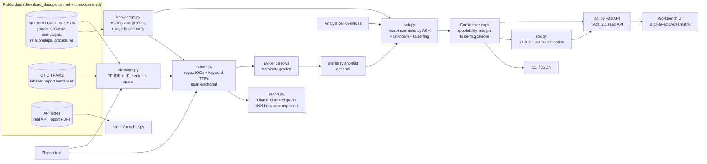
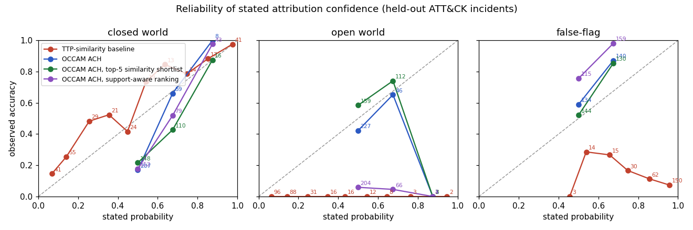

# OCCAM

[](https://github.com/rakshit-737/occam/actions/workflows/ci.yml)
[](https://rakshit-737.github.io/occam/)
[](https://github.com/rakshit-737/occam/releases)

[](LICENSE)


**Auditable threat-intel reasoning. OCCAM extracts ATT&CK TTPs from report prose, clusters activity into campaigns, and runs Analysis of Competing Hypotheses (ACH) attribution. Its confidence levels hold up against false flags, and it is benchmarked on real MITRE ATT&CK, TRAM2 and APTnotes data.**

MISP stores indicators. ATT&CK Navigator paints heatmaps. Neither one *reasons*. OCCAM reads threat reporting and extracts ATT&CK techniques, software and IOCs, and each hit is anchored to the span of source text it came from. It then groups activity into campaigns on a Diamond-model graph. For attribution it builds a transparent **Heuer ACH matrix** that always includes *unknown actor* and *false flag* hypotheses. Confidence is graded to go **down** when the case rests on evidence that is cheap to plant.

**Docs:** <https://rakshit-737.github.io/occam/> · **Live static workbench demo:** <https://rakshit-737.github.io/occam/demo/> · **Image:** `ghcr.io/rakshit-737/occam`

> The rules and models propose; the ACH matrix and the analyst decide. Every cell can be overridden, and the result recomputes deterministically.

## Headline results (real data, reproducible)

| Question | Data | OCCAM | Baseline |
| --- | --- | --- | --- |
| When 3 planted markers frame another group, how often is the framed group named? | 274 held-out ATT&CK incidents | **1.1%** | 88.0% (TTP-similarity) |
| How often is a wrong answer given at ≥0.8 stated probability under false flags? | same | **0.0%** | 70.8% |
| Brier score under false flags (lower is better) | same | **0.199** | 0.700 |
| When the true group is untracked, how often is the answer correctly "unknown"? | same, true group removed | **46%** (64% with shortlist) | 0% (baseline always names someone) |
| Closed-world top-1 attribution accuracy | same | 30% (40% with opt-in support-aware ranking) | **53%** |
| Closed-world Brier with the learned grade map (cross-fitted) | same | **0.156** | 0.179 |
| TTP extraction, document micro-F1 | TRAM2, 151 reports, 5-fold CV | **0.710** (TF-IDF+LR) | 0.387 (keyword) |
| Campaign clustering ARI (held-out groups) | 509 ATT&CK activity slices | **0.249** (kNN-Louvain) | 0.107 (single linkage) |

This is the trade-off the project set out to measure. **Mandatory disconfirming-evidence weighting makes attribution much harder to steer with false flags, and far less overconfident. The price is naming the right group less often when nobody is lying.** Full tables, confidence intervals and caveats follow below.

## Architecture



| Module | Role | Extra deps |
| --- | --- | --- |
| `occam/models.py` | Typed contracts: `Evidence`, `ActorProfile`, `Hypothesis`, `Assessment`, `SourceSpan`, Admiralty weights | none |
| `occam/knowledge.py` | Full ATT&CK STIX loader: techniques, groups, software, campaigns, `uses` and `attributed-to` relationships, procedure examples; builds per-group actor profiles and a usage-based KB | none |
| `occam/attack.py` | Compact KB (bundled synthetic subset or converted ATT&CK); data-driven *common* and *rare* flags | none |
| `occam/extract.py` | Defang-aware IOC regexes and keyword TTP/software matching; can merge in classifier hits. Every hit carries a `SourceSpan` | none |
| `occam/classifier.py` | Multi-label sentence classifier (TF-IDF + one-vs-rest logistic regression) trained on ATT&CK procedures and TRAM2 | `ml` |
| `occam/ach.py` | Hypothesis generation, cell rating, diagnosticity, least-inconsistency ranking, confidence caps, sensitivity analysis | none |
| `occam/attribution.py` | `ACHAttributor` (optional similarity shortlist) and the naive `SimilarityAttributor` baseline | none |
| `occam/evaluation.py` | Leave-one-report-out attribution benchmark (closed, open and false-flag settings), cross-fitted recalibration | none |
| `occam/graph.py` | Diamond-model graph; IDF-weighted Jaccard kNN event graph and Louvain communities | `graph` |
| `occam/cluster.py` | Original weighted-Jaccard + union-find clusterer (baseline) | none |
| `occam/metrics.py` | P/R/F1, Brier, ECE, reliability, purity, NMI, ARI | none |
| `occam/stix.py` | STIX 2.1 export (confidence and ACH matrix travel together) and strict `stix2` validation | `stix` (validation only) |
| `occam/api.py`, `occam/web/` | FastAPI service, read-only TAXII 2.1 collection, analyst workbench | `api` |
| `occam/cli.py` | `extract`, `cluster`, `ach`, `attribute`, `train-classifier`, `load-attack`, `demo` | none |

### How the ACH works
1. **Hypotheses.** Each candidate actor gets one. Each actor that spoofable markers point at also gets a *False flag: someone framed X* hypothesis. *Unknown actor* is always included.
2. **Cells** use CC/C/N/I/II. On real ATT&CK data, a technique used by ≥30% of groups is non-diagnostic (N). One used by ≤3 groups rates CC when it matches. A technique that matches only at the parent level is N. Spoofable evidence (code overlap, language artefacts, metadata, claims) supports the matching false-flag hypothesis.
3. **Weight** = Admiralty reliability × credibility × relevance × *diagnosticity*, where diagnosticity is how much the row's ratings vary across hypotheses. Non-diagnostic rows weigh 0, and spoofable rows are multiplied by 0.5.
4. **Rank** by least weighted inconsistency, following Heuer. Support is shown but never used for ranking. Ties go to the more conservative conclusion: unknown, then false flag, then a named actor.
5. **Confidence** comes from the relative margin and the number of diagnostic items, and then caps apply. It drops to LOW if most support is spoofable. It is held at MODERATE or below for deception or unknown conclusions, when a same-actor false flag is not decisively rejected, or when planted-marker indicators exist.
6. **What would change this.** A leave-one-out pass lists the evidence whose removal would flip the leader, and the items the runner-up's rejection hinges on.

Design rationale is recorded in [docs/adr/](docs/adr/).

## Results

All numbers below come from `python scripts/bench_*.py` on the pinned datasets. The raw JSON is in [`results/`](results/).

### 1. Attribution on held-out ATT&CK group usage
Protocol ([ADR 0004](docs/adr/0004-leave-one-report-out-evaluation.md)):
- Every (group, cited report) pair with ≥4 techniques or software becomes an incident. That gives **274 incidents from 103 groups**, with at most 3 per group.
- Items supported only by that report are removed from the group's profile before attributing, and there are 176 candidate profiles.
- **closed**: the true group is a candidate. **open**: the true group is removed, so the correct answer is to decline. **false_flag**: 3 spoofable markers frame a random other group.

| Setting | Method | Correct [95% CI] | Names true group | Names framed group | Brier [95% CI] | ECE | Wrong at p≥0.8 |
|---|---|---|---|---|---|---|---|
| closed | TTP-similarity baseline | **0.533** [0.47-0.59] | **0.533** | – | **0.179** [0.15-0.21] | 0.102 | 0.011 |
| closed | OCCAM ACH | 0.299 [0.25-0.35] | 0.299 | – | 0.238 [0.23-0.25] | 0.257 | **0.000** |
| closed | OCCAM ACH + top-5 shortlist | 0.339 [0.28-0.40] | 0.339 | – | 0.264 [0.25-0.28] | 0.253 | 0.007 |
| open | TTP-similarity baseline | 0.000 | – | – | **0.077** [0.06-0.10] | 0.206 | 0.015 |
| open | OCCAM ACH | 0.460 [0.41-0.52] | – | – | 0.248 [0.24-0.26] | **0.071** | **0.004** |
| open | OCCAM ACH + top-5 shortlist | **0.642** [0.59-0.70] | – | – | 0.234 [0.22-0.25] | 0.086 | 0.011 |
| false_flag | TTP-similarity baseline | 0.113 [0.08-0.15] | **0.113** | 0.880 | 0.700 [0.67-0.74] | 0.755 | 0.708 |
| false_flag | OCCAM ACH | **0.734** [0.68-0.78] | 0.022 | **0.011** | **0.199** [0.19-0.21] | 0.144 | **0.000** |
| false_flag | OCCAM ACH + top-5 shortlist | 0.679 [0.62-0.73] | 0.018 | **0.011** | 0.206 [0.20-0.22] | **0.096** | **0.000** |
| closed | ACH, support-aware ranking (opt-in) | 0.401 [0.34-0.46] | 0.401 | – | 0.223 [0.21-0.24] | 0.240 | 0.004 |
| open | ACH, support-aware ranking (opt-in) | 0.055 [0.03-0.08] | – | – | 0.303 [0.29-0.32] | 0.493 | 0.015 |
| false_flag | ACH, support-aware ranking (opt-in) | 0.887 [0.85-0.92] | 0.131 | 0.015 | 0.170 [0.16-0.18] | 0.285 | **0.000** |



How to read this:
- **Under false flags the baseline falls apart.** It names the framed group 88% of the time, usually at "high" confidence. ACH names the framed group 1.1% of the time and makes no overconfident errors. Instead it concludes that someone framed X, which is true in this setting.
- **With no deception, the naive baseline names the right group more often** (53% vs 30%). ACH's least-inconsistency rule favours groups with large profiles and often declines to name anyone. That is the cost of conservatism, and it is reported as such.
- **ACH still rarely names the *true* group behind a false flag** (2%). It detects the deception but will not go further than the evidence supports. Recovering the true actor is a harder problem.
- In the open world the baseline's Brier score looks good (0.077) only because it states low probabilities while always naming someone. Its correct-decline rate is 0%.
- Cross-fitted histogram recalibration (2-fold split by group, in `results/attribution.json`) brings closed-world ACH to Brier 0.156, better than the recalibrated baseline's 0.180. ACH's grades separate right from wrong answers well, but their raw probability mapping is too optimistic. Recalibration also rescues the baseline's *probabilities* under false flags (Brier 0.100), but it cannot stop the baseline from naming the framed group.

**Support-aware ranking (v1.0, opt-in).** Adding half of the non-spoofable support to Heuer's inconsistency score reduces the large-profile bias: closed-world top-1 rises from 0.299 to 0.401, and the true group behind a false flag is named 13% of the time instead of 2%. But the unknown hypothesis never receives support, so correct declines on untracked actors collapse from 46% to 5.5%. Declining is a safety property, so pure Heuer stays the default ([ADR 0007](docs/adr/0007-calibrated-grades-and-support-aware-ranking.md)).

**Learned grade map (v1.0).** `GradeCalibrator` learns the probability for each ACH grade (Beta-smoothed, monotone), replacing fixed ICD-203 midpoints. Cross-fitted by group, ACH Brier improves in every setting (closed 0.238 to 0.156, open 0.248 to 0.245, false flag 0.199 to 0.177). The shipped map is `results/grade_calibration.json`: low 0.37, moderate 0.78, high 0.82. Use it with `occam attribute --calibration`.

**Seed variance.** The false-flag setting frames a random group, so it was re-run with 5 framing seeds (7, 11, 13, 17, 19). ACH correct 0.718 ± 0.015, framed 0.008 ± 0.005; baseline correct 0.119 ± 0.008, framed 0.875 ± 0.008. Closed and open settings use every incident and have no random component.

### 2. TTP extraction on TRAM2
151 real CTI reports, 19,178 sentences and 50 ATT&CK techniques. The protocol is 5-fold cross-validation grouped by document, with thresholds tuned on an inner 20% document split.

| Method | Sent. P | Sent. R | Sent. micro-F1 | Sent. macro-F1 | Doc P | Doc R | Doc micro-F1 | Doc macro-F1 |
|---|---|---|---|---|---|---|---|---|
| Keyword baseline (ATT&CK technique names) | 0.395 | 0.071 | 0.121 | 0.134 | **0.686** | 0.270 | 0.387 | 0.355 |
| TF-IDF+LR, ATT&CK procedures only (no TRAM text) | 0.376 | 0.387 | 0.381 | 0.353 | 0.552 | 0.703 | 0.618 | 0.579 |
| TF-IDF+LR, ATT&CK + TRAM training folds | **0.471** | **0.518** | **0.493** | **0.446** | 0.647 | **0.787** | **0.710** | **0.663** |

A model trained only on MITRE's own procedure examples already transfers to vendor reports, reaching document micro-F1 0.618. Adding in-domain TRAM sentences raises that to 0.710. The best techniques reach sentence-level F1 of about 0.7: T1140 Deobfuscate/Decode, T1021.001 RDP and T1056.001 Keylogging. The worst are rare or vaguely worded, such as T1569.002 Service Execution at 0.18. The TRAM repository publishes no reference F1 for its SciBERT models, so no direct comparison is claimed.

### 3. Campaign clustering
The events are 509 real per-report slices of ATT&CK group activity plus attributed ATT&CK campaigns, from groups with ≥4 events. Hyperparameters are tuned on dev groups (even G-numbers) and reported on 270 events from 36 disjoint test groups. Clustering uses capability only, because ATT&CK has no infrastructure.

| Method | Purity | NMI | ARI | #clusters |
|---|---|---|---|---|
| **Louvain, IDF-weighted Jaccard kNN graph** (k=10, res=5.0, dev-tuned) | 0.511 | 0.642 | **0.249** | 37 |
| Louvain, dense graph (no kNN) | 0.178 | 0.255 | 0.047 | 4 |
| Single-linkage Jaccard (t=0.3, dev-tuned = default) | 0.800 | 0.694 | 0.107 | 181 |
| Trivial: one cluster per event | 1.000 | 0.753 | 0.000 | 270 |

ARI is the headline metric, because purity and NMI reward over-splitting. In earlier runs the test-split event order followed `PYTHONHASHSEED`, and kNN-Louvain ARI moved between about 0.22 and 0.27 from run to run. Runs are now deterministic, and that spread is a fair indication of the method's sensitivity to input order.

### 4. End-to-end on real APT reports (APTnotes)
This is the only test on raw prose. The pipeline runs over the text of public APT report PDFs whose filename names an ATT&CK group, and attributes against the full ATT&CK profile set. `bench_aptnotes.py` produces the tables ([keyword](results/aptnotes.md), [keyword + classifier](results/aptnotes_clf.md)).

| Extractor | Reports / groups | Techniques per report | Attributor | Top-1 | Top-5 | Names someone | Brier | Wrong at p≥0.8 |
|---|---|---|---|---|---|---|---|---|
| keyword | 54 / 29 | 3.7 | TTP-similarity baseline | 0.370 | 0.574 | 1.000 | 0.371 | 0.111 |
| keyword | 54 / 29 | 3.7 | OCCAM ACH | 0.370 | 0.481 | 0.852 | **0.214** | **0.000** |
| keyword | 54 / 29 | 3.7 | OCCAM ACH, top-5 shortlist | 0.352 | 0.574 | 0.667 | 0.222 | **0.000** |
| keyword + classifier | 57 / 30 | 44.0 | TTP-similarity baseline | 0.123 | 0.281 | 1.000 | 0.066 | 0.000 |
| keyword + classifier | 57 / 30 | 44.0 | OCCAM ACH | 0.053 | 0.228 | 0.228 | 0.280 | 0.000 |
| keyword + classifier, top-10 per report | 57 / 30 | 12.3 | TTP-similarity baseline | 0.333 | 0.544 | 1.000 | 0.208 | 0.000 |
| keyword + classifier, top-10 per report | 57 / 30 | 12.3 | OCCAM ACH | 0.193 | 0.368 | 0.579 | 0.255 | 0.000 |

What this shows:
- **On real prose, ACH matches the baseline on top-1 (0.37) and removes its overconfident errors** (11% of answers wrong at p≥0.8 vs 0%). Most of the signal comes from software names such as PlugX or Mimikatz, not from techniques.
- **The sentence classifier hurts end-to-end attribution.** On long vendor reports it fires on about 44 techniques per report, and most of them are generic. That drowns out the diagnostic rows for both attributors. It helps on TRAM2 but should be used with a much higher threshold, or with per-report top-k, when feeding ACH. The row is reported rather than hidden. Capping the classifier at its 10 most confident techniques per report (`--top-k 10`, v1.0) recovers much of the loss (ACH top-1 0.053 to 0.193, baseline 0.123 to 0.333) but is still worse than keyword-only extraction, so keyword-only stays the recommended input for ACH.
- Clustering the keyword-extracted reports gives ARI 0.258 with kNN-Louvain vs 0.081 with single linkage (purity 1.0 for both, 48 vs 52 clusters).

## Quickstart

```bash
git clone https://github.com/rakshit-737/occam && cd occam
python -m pip install -e ".[dev,pdf,bench]"      # core alone: pip install -e .  (zero deps)
python -m pytest -q                               # 75+ tests; real-data tests skip without data
python -m occam demo                              # synthetic scenarios, incl. Olympic-Destroyer-style false flag
```

### Synthetic demo scenarios (bundled)
| Scenario | Outcome |
| --- | --- |
| `clean_attribution` | ACTOR-QUILL, **HIGH** confidence |
| `false_flag_games` | Follows the public *structure* of the Olympic Destroyer case. Planted code, metadata and language markers point at EMBER, and hard evidence contradicts it. OCCAM does **not** name EMBER. It leads with a false-flag hypothesis at **LOW** confidence and lists the planted-marker indicators |
| `thin_evidence` | *Unknown actor*, **LOW** |

```bash
python -m occam ach occam/demo/scenarios/false_flag_games.json
python -m occam ach occam/demo/scenarios/clean_attribution.json --override E1:H-QUILL=II --json   # analyst flips a cell
python -m occam ach occam/demo/scenarios/false_flag_games.json --stix                            # STIX 2.1 bundle
python -m occam extract occam/demo/reports/r3_tide_energy.txt --navigator > layer.json           # ATT&CK Navigator layer
```

### Real data
```bash
python scripts/download_data.py                   # ~180 MB into ../../datasets/occam (or $OCCAM_DATA)
D=../../datasets/occam
python -m occam train-classifier --attack $D/enterprise-attack-19.2.json --tram $D/tram/multi_label.json --out model.pkl
python -m occam attribute report.txt --attack $D/enterprise-attack-19.2.json --classifier model.pkl
```
`occam attribute` prints each evidence item with the source span it came from, the ACH matrix over the shortlisted ATT&CK groups plus the unknown and false-flag hypotheses, a confidence grade, the false-flag checks and a "what would change this conclusion" section.

### API, workbench and TAXII
```bash
uvicorn occam.api:app --host 127.0.0.1 --port 8000     # or: docker compose up --build
# http://127.0.0.1:8000/          analyst workbench: click a cell to cycle CC/C/N/I/II, see confidence update
cd ui && npm ci && npm run dev    # React/Vite workbench (proxies to the API; static demo mode without it)
# POST /extract  POST /ach  POST /stix  GET /taxii2/  GET /taxii2/api/collections/{id}/objects/
```

## Reproducibility
`make` is optional; the table lists the underlying commands.

| Step | Command | Runtime (laptop, i5-13500H) |
| --- | --- | --- |
| Data | `python scripts/download_data.py` | ~10 min |
| Extraction bench | `python scripts/bench_extraction.py` | ~15-25 min |
| Attribution bench | `python scripts/bench_attribution.py` | ~2 min |
| Clustering bench | `python scripts/bench_clustering.py` | ~2 min |
| APTnotes bench | `python scripts/bench_aptnotes.py [--model model.pkl]` | ~10 min |

All randomness is seeded. Dataset commits and SHA-256 hashes are pinned in `scripts/download_data.py`. CI runs ruff, runs the tests on Python 3.10, 3.12 and 3.13, and runs a job with **no dependencies at all** to prove the core is standard-library only.

## Datasets
| Dataset | Use | Licence |
| --- | --- | --- |
| [MITRE ATT&CK Enterprise 19.2](https://github.com/mitre-attack/attack-stix-data) (STIX 2.1): 176 groups, 825 software, 697 techniques, 18,457 `uses` relationships | Actor profiles, rarity, classifier training, attribution benchmark | [ATT&CK Terms of Use](https://attack.mitre.org/resources/legal-and-branding/terms-of-use/) |
| [CTID TRAM2](https://github.com/center-for-threat-informed-defense/tram): 151 reports, 19,178 sentences, 50 techniques | Extraction benchmark, classifier training | Apache-2.0 |
| [APTnotes](https://github.com/aptnotes/data) / [kbandla/APTnotes](https://github.com/kbandla/APTnotes): 58 filename-labelled public APT reports | End-to-end benchmark | © respective publishers; not redistributed |

Details, pins and caveats are in [docs/data.md](docs/data.md). No dataset is committed, and no malware is ever downloaded.

## Prior art and how OCCAM differs
| Tool / work | Strength | What OCCAM adds |
| --- | --- | --- |
| MISP | IOC storage and sharing | Reasoning over the indicators |
| OpenCTI | STIX knowledge graph | Automated, auditable ACH scoring; exports STIX and can sit on top of OpenCTI |
| ATT&CK Navigator | Visualisation | Emits Navigator layers and reasons over them |
| TRAM / rcATT | Text-to-ATT&CK classification | Uses TRAM2 data. The classifier is one component, and its output is span-anchored evidence for ACH, not an answer |
| PARC ACH / spreadsheets | Manual ACH | Rule-proposed cells, Admiralty weights, data-driven diagnosticity, mandatory false-flag and unknown hypotheses, sensitivity analysis, calibration measured on real data |
| Commercial TIPs | Enrichment and scoring | Open, overridable attribution logic |

OCCAM claims no novelty for STIX, ATT&CK or IOC handling. Its contribution is the reasoning layer and a reproducible measurement of how that layer behaves under deception.

## Limitations
- **Closed-world accuracy is modest.** Heuer-style least-inconsistency favours large ATT&CK profiles, and ACH names the right group less often than naive similarity when there is no deception. The opt-in support-aware ranking narrows the gap (40% vs 53%) but gives up declining on untracked actors.
- **The false-flag evaluation uses synthetic markers.** Planted markers are evidence rows, not real forged artefacts. The benchmark tests how the reasoning responds to deception, not how well it detects it in binaries.
- **Incidents are reported slices of ATT&CK, not telemetry.** Real investigations are noisier; see the APTnotes section.
- **APTnotes numbers are optimistic.** ATT&CK profiles are partly built from these same reports. Labels come from filenames, and the set covers only 54-57 reports.
- **The keyword extractor has low recall**, and the classifier has moderate precision and over-fires on long reports unless capped with `--top-k`.
- **The API has no authentication.** It is for local lab use only, and docker-compose binds it to 127.0.0.1. The static web demo recomputes the ranking in the browser but not the confidence grade.

**Not done, and why:** spaCy and LLM extractors (heavy dependencies, and they need a human-judged span-grounded evaluation set that is not reproducible in CI); a live Neo4j/OpenCTI deployment (OCCAM emits an idempotent Cypher script via `occam cluster --cypher`, not load-tested against a running server); a persistent TAXII collection (kept read-only and in-memory until authentication exists).

## Roadmap
- Learn the support weight with an explicit abstention threshold, so the support-aware ranking can still decline.
- spaCy entity and relation extraction and an optional LLM extractor, both held to the span contract.
- A Neo4j/OpenCTI adapter tested against a container in CI.
- An authenticated, persistent TAXII collection.


## Safety and ethics of attribution
- **Decision support, not a verdict.** Attribution has diplomatic, legal and human consequences. Every output states that it needs human analytic review, and results about real ATT&CK groups are benchmark artefacts, not findings.
- **Designed against overconfidence.** It has mandatory unknown and false-flag hypotheses, a spoofable-evidence discount, conservative tie-breaks and confidence caps.
- **Lab only, no offensive capability.** OCCAM reads text and JSON. It does no scanning, never contacts infrastructure and never downloads malware. Report PDFs are parsed as text in a sandboxed child process with a timeout.

See [THREAT_MODEL.md](THREAT_MODEL.md), [SECURITY.md](SECURITY.md) and [CONTRIBUTING.md](CONTRIBUTING.md).

## License
The code is MIT-licensed; see [LICENSE](LICENSE). ATT&CK® IDs and names are © The MITRE Corporation and used under the ATT&CK Terms of Use. TRAM2 data is Apache-2.0 (CTID). APTnotes reports are © their publishers and are not redistributed.
