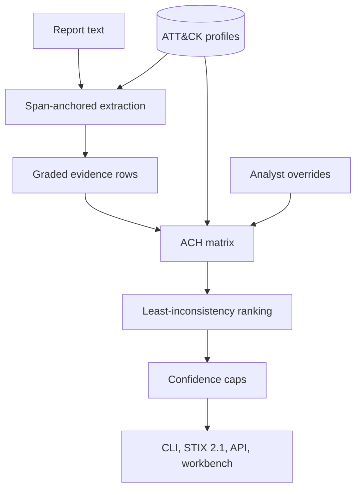

# OCCAM

[](https://github.com/rakshit-737/occam/actions/workflows/ci.yml)
[](https://rakshit-737.github.io/occam/)
[](https://github.com/rakshit-737/occam/releases)

[](LICENSE)


**Auditable attribution for threat intelligence: span-anchored ATT&CK extraction, campaign clustering, and Analysis of Competing Hypotheses that has to consider "unknown actor" and "someone framed X".**

**Contribution.** An open, leakage-controlled benchmark for attack attribution under planted, authentic and mimicked false-flag evidence, plus an auditable ACH engine measured on it; the numbers, including where ACH loses, are in the table below.

[](https://rakshit-737.github.io/occam/demo/)

**Docs:** <https://rakshit-737.github.io/occam/> · **Live demo:** <https://rakshit-737.github.io/occam/demo/> · **Evaluation:** [docs/evaluation.md](docs/evaluation.md) · **Preprint (PDF):** <https://rakshit-737.github.io/occam/preprint.pdf> ([source](paper/))

## Research question and answer

*Does automated ACH with mandatory disconfirming-evidence weighting give better-calibrated, less overconfident attribution than naive TTP-similarity matching, especially under false flags?*

Mostly no. Its remaining advantage is an inspectable matrix with span-anchored evidence, which is a design property and is not measured here.

- **Calibration: worse overall.** Under one setting-agnostic calibration map, ACH's pooled Brier score is 0.214 against 0.160 for the marker-trusting similarity matcher (paired difference +0.031 to +0.080). The pool is an equal mix of closed, open and planted-marker incidents. ACH is better only in the closed world: 0.189 vs 0.315 (paired −0.178 to −0.075).
- **Overconfidence: a property of the raw outputs.** Under planted markers, ACH's capped grades are never wrong at stated p ≥ 0.8 (0/274), while the matcher's softmax is (194/274, 70.8%). After the same recalibration neither method makes such errors (ACH 1/822, matcher 0/822).
- **Planted markers.** ACH names the framed group 1.1% of the time against 88.0% for the matcher. A baseline that simply ignores spoofable rows is never framed (0/274), and a consistency gate is correct more often (92.0% vs 73.4%).
- **Mimicry.** ACH is framed less often than IDF coverage (27.0% vs 32.1%; paired −8.6 to −1.8 points) but is also correct less often (17.9% vs 28.8%; paired −16.0 to −6.6 points).
- **Declining on untracked actors.** A cosine-threshold baseline declines more often at the same closed-world accuracy. Tuned to ACH's 29.9% closed-world accuracy, it declines 93.4% of the time against ACH's 46.0% (paired −54.8 to −39.6 points). Tuned to ACH's decline rate, it is right 47.4% of the time in the closed world against ACH's 29.9%.
- **Cost.** ACH is worse when nobody is lying.

| Question (274 held-out ATT&CK incidents, 103 groups) | OCCAM ACH | Best simple baseline | Naive TTP-similarity |
| --- | --- | --- | --- |
| Framed group named, 3 planted spoofable markers | 1.1% [0.0–2.6] | **0%** [0.0–3.6]† (similarity ignoring spoofable rows) | 88.0% [82.3–93.3] |
| Correct under planted markers (true group named or frame detected) | 73.4% [66.9–79.6] | **92.0%** [88.4–95.2] (consistency gate, cross-fitted) | 11.3% [6.4–16.9] |
| Genuine markers wrongly called a frame-up | 18.6% [13.8–24.4] | 0% [0.0–3.6]† (similarity) / 23.0% [16.7–29.2] (gate) | 0% [0.0–3.6]† |
| Framed group named, **mimicry** of 3 rare TTPs/tools | **27.0%** [21.3–33.5] | 32.1% [25.4–39.2] (IDF coverage) | 76.3% [70.9–81.8] |
| Correct under mimicry (true group named or frame detected) | 17.9% [12.2–23.8] | **28.8%** [21.9–35.8] (IDF coverage) | 21.2% [15.5–27.0] |
| Correct "unknown" when the true group is untracked | 46.0% [39.3–53.1] (64.2% with a top-5 shortlist) | **93.4%** [90.6–96.1] (decline below a cosine threshold matched to ACH's closed-world accuracy) | 0% [0.0–3.6]† |
| Closed-world top-1 | 29.9% [22.9–37.1] | **53.3%** [45.3–60.8] (similarity) | 53.3% [45.3–60.8] |
| Brier, one setting-agnostic calibration map, closed + open + planted pooled (lower is better) | 0.214 [0.202–0.226] | 0.214 [0.203–0.226] (abstaining baseline) | **0.160** [0.141–0.178]; ACH minus it: +0.031 to +0.080 |
| Wrong at stated p ≥ 0.8, planted markers, raw outputs | **0/274** | 3/274 (similarity ignoring spoofable rows) | 194/274 |
| Closed / open / planted on 575 incidents, 21 campaigns, temporal splits | open and planted: same direction; closed: lower on 575 incidents (39.0% vs 47.8%), tied in temporal splits ([extended](results/attribution_extended.md)); controls and mimicry not re-run there | | |

Brackets are 95% group-cluster bootstrap intervals, and paired differences use the same resamples. † marks a rate of exactly 0 or 1, where the bootstrap interval is degenerate; a Wilson interval with the 103 groups as the sample size is shown instead. Sources: [`results/falseflag.md`](results/falseflag.md) / `.json` and [`results/attribution.md`](results/attribution.md). Both were produced by bench run [37093689060](https://github.com/rakshit-737/occam/actions/runs/37093689060) at commit `09cde53`, and every benchmark result JSON records its run in `provenance` (the fitted map `results/grade_calibration.json` has none; it is written by the same `bench_attribution.py` run as `results/attribution.json`).

## Try it in 60 seconds

**Browser:** open the [live workbench demo](https://rakshit-737.github.io/occam/demo/) and click any matrix cell.

**Docker** (API + workbench on loopback only):

```bash
docker run --rm -p 127.0.0.1:8000:8000 ghcr.io/rakshit-737/occam:latest    # then open http://127.0.0.1:8000/
```

**Python, zero dependencies:**

```bash
git clone --depth 1 https://github.com/rakshit-737/occam && cd occam
python -m pip install -e . && occam demo          # or: python -m occam demo
occam ach false_flag_games                         # one bundled scenario
```

Expected output (abridged):

```text
ASSESSMENT: It is roughly even chance / cannot be determined that: False flag: another actor framed ACTOR-EMBER
CONFIDENCE: LOW
False-flag indicators considered:
  - Markers implicate ACTOR-EMBER, but hard evidence ['E5', 'E6', 'E7', 'E8', 'E9'] contradicts that actor.
```

## How it works



1. **Evidence** rows come from report text (every technique, tool and IOC keeps the source span it came from) or from analysts, with an Admiralty grade. Code overlap, language artefacts, metadata and claims are typed **spoofable**.
2. **Hypotheses**: every candidate actor, plus *unknown actor*, plus *false flag: someone framed X* for every actor a spoofable marker points at.
3. **Cells** CC/C/N/I/II are proposed by rules (rarity measured from ATT&CK usage) and can be overridden by an analyst.
4. **Weights** = Admiralty grade x diagnosticity (rows that rate every hypothesis the same weigh 0); spoofable rows x0.5.
5. **Ranking** by least weighted inconsistency (Heuer), ties to the more conservative conclusion.
6. **Confidence** from margin and diagnostic count, then capped (LOW if support is mostly spoofable; at most MODERATE for deception/unknown conclusions or when planted-marker indicators fire). A leave-one-out pass reports what would change the conclusion.

A step-by-step walkthrough with the matrix is on [How it works](docs/how-it-works.md); design decisions are in [docs/adr/](docs/adr/).

| Module | Role | Extra deps |
| --- | --- | --- |
| `occam/extract.py`, `occam/classifier.py` | Span-anchored IOC/TTP/software extraction; optional TF-IDF + LR sentence classifier | none / `ml` |
| `occam/knowledge.py`, `occam/attack.py` | ATT&CK STIX loader, group profiles, usage-based rarity | none |
| `occam/ach.py` | Hypotheses, cell rating, diagnosticity, ranking, confidence caps, sensitivity; ablation switches | none |
| `occam/attribution.py` | `ACHAttributor` and the similarity / IDF-coverage baselines | none |
| `occam/evaluation.py`, `occam/calibration.py` | Held-out protocols (closed, open, false flag, authentic, mimicry, campaigns, temporal) and calibration | none |
| `occam/graph.py`, `occam/neo4j.py` | Diamond graph, kNN-Louvain campaigns, Cypher export | `graph` |
| `occam/stix.py`, `occam/api.py`, `ui/` | STIX 2.1 export, FastAPI + read-only TAXII 2.1, React workbench | `stix`, `api` |

## Results

Every table is generated by `scripts/bench_*.py` from pinned public data. The JSON and Markdown are in [`results/`](results/), and each file names the GitHub Actions run and commit that produced it: bench run [37093689060](https://github.com/rakshit-737/occam/actions/runs/37093689060) for all of them. The [`bench` workflow](.github/workflows/bench.yml) regenerates them and lists any value that changed. The [Evaluation page](https://rakshit-737.github.io/occam/evaluation/) has every table with its methodology.

**False flags, controls and ablations** ([`results/falseflag.md`](results/falseflag.md)).
- *What blocks the frame.* Removing ACH's false-flag hypotheses leaves the framed-group rate at 1.1% and raises "names the true group" from 2.2% to 20.1%. With the hypotheses, the x0.5 spoofable discount and the caps all removed, it is still only 2.6%. The resistance therefore comes from hard evidence contradicting the framed group, which both ranking rules honour (support-aware ranking is framed 1.5%). For the baselines, ignoring spoofable rows is enough. The false-flag hypotheses only turn outcomes into explicit "framed" conclusions.
- *Caps.* The confidence caps change no accuracy metric and do not improve calibration: pooled Brier is 0.214 with them and 0.207 without (variant minus full: −0.010 to −0.005).
- *Spoofable discount.* It moves accuracy by under 2 points and does improve calibration: 0.231 without it (+0.010 to +0.023).
- *Number of markers.* From 1 to 6 markers, the naive matcher goes from 12.4% to 100% framed. ACH stays at about 1% under planted markers and rises from 6.6% to 44.2% under mimicry.
- *Diagnosticity weighting* is not what limits mimicry framing: without it, ACH is framed 18.2% of the time.

**Abstention trade-off** ([figure](docs/figures/abstention_frontier.png)). ACH's operating point (29.9% closed-world top-1, 46.0% correct declines) lies inside the cosine-threshold baseline's frontier.
- With the threshold cross-fitted to ACH's decline rate, the baseline is right 47.4% of the time in the closed world (paired −25.4 to −10.0 points for ACH).
- Matched to ACH's closed-world accuracy, it declines 93.4% of the time.
- Because this baseline ignores rarity, it is framed more under mimicry: 44.5% to 71.5% across its operating points, against ACH's 27.0%.

**Threshold sensitivity** ([`results/sensitivity.md`](results/sensitivity.md)). The cell-rule thresholds (common: ≥30% of groups; rare: ≤3 groups) were set by hand. Over a 3 x 3 grid:

| Metric | Range across the grid |
| --- | --- |
| Closed-world accuracy | 27.0–35.4% |
| Correct declines | 36.9–59.1% |
| Framed under planted markers | 0.7–1.1% |
| False alarms on genuine markers | 15.0–27.4% |
| Framed under mimicry | 24.8–36.1% |

Choosing the thresholds on one group fold and applying them to the other picks a 20% cut-off. Compared with the shipped thresholds, that choice:
- raises closed-world accuracy by 4.0 points (paired +1.5 to +6.9);
- raises false alarms by +4.2 to +10.8 points;
- raises mimicry framing by +5.3 to +12.4 points.

**Held-out attribution** ([`results/attribution.md`](results/attribution.md)). Closed, open and false-flag settings on 274 incidents from 103 groups, with group-cluster CIs, per-setting and setting-agnostic calibration, and 5 framing seeds.
- The per-setting learned grade map gives a closed-world Brier of 0.156 against 0.180 for the similarity baseline with its own per-setting map. That map knows which setting it is in, so it is an oracle upper bound.
- The deployable pooled map gives 0.189 against 0.315.

**Extended protocols** ([`results/attribution_extended.md`](results/attribution_extended.md)). These cover all 575 report incidents, 21 held-out campaigns, 31 unattributed campaigns, and temporal splits (profiles from ATT&CK v12.1 / v15.1, incidents added later). The authentic, mimicry and simple-baseline controls were run only on the 274-incident set.
- Against the naive matcher, open-world declines and planted-marker resistance point the same way as on the main set.
- Closed-world accuracy is lower for ACH on the 575 incidents (39.0% vs 47.8%) and tied in the temporal splits (21.3% vs 20.2% for v12.1).
- After renamed technique ids are mapped back to the old release, ACH's correct-decline rate in the v12.1 split is 50.6%.

**Reproduction of published TTP extraction (rcATT)** ([`results/rcatt_reproduction.md`](results/rcatt_reproduction.md)).
- *Published numbers.* Legoy et al. (2020) report tactic micro F0.5 65.38 ± 2.87 and technique micro F0.5 35.02 ± 5.32 (arXiv:2004.14322v1, Table 4, "Inde." rows; the same means are in Tables 2 and 3).
- *Released code.* Run on its 1,490 reports with the released code's 5-fold split (KFold, shuffle, seed 42), it gives 64.82 ± 3.44 for tactics. For techniques it gives 36.33 ± 1.39 on the 197 techniques that the paper's at-least-5-reports filter keeps in the released data.
- *Why code and paper differ.* The released code departs from the paper text in two undocumented settings: stemming/lemmatisation and balanced class weights. A 2 x 2 ablation on the same folds attributes most of the technique gap to class weighting (+5.9 ± 2.5 micro F0.5 points, fold-paired) and little to tokenisation (+0.3 ± 0.6). For tactics, balanced weights slightly lower micro F0.5 (−1.7 ± 0.9).
- *OCCAM.* Its TF-IDF + LR reaches 34.18 micro but only 12.94 macro F0.5, so it is not better than rcATT on this task.

**TTP extraction on TRAM2** ([`results/extraction.md`](results/extraction.md)). TF-IDF + LR trained on ATT&CK procedures plus TRAM folds reaches document micro-F1 0.710 (document-bootstrap 95% CI 0.680–0.738; fold SD 0.023). Trained on ATT&CK procedures alone it reaches 0.618, and keywords reach 0.388. Two caveats:
- Two TRAM labels are revoked in ATT&CK 19.2 (3.3% of gold labels).
- Some TRAM reports are also cited by ATT&CK procedure examples, so the "ATT&CK only" model is not fully independent of the test reports.

**Campaign clustering** ([`results/clustering.md`](results/clustering.md)). On 270 held-out events from 36 groups:

| Method | ARI [95% group-jackknife interval] |
| --- | --- |
| kNN-Louvain | 0.249 [0.17–0.32] |
| Dense-graph Louvain, tuned the same way | 0.203 [0.14–0.26] |
| Single linkage | 0.107 |

The kNN-minus-dense ARI difference is −0.019 to +0.110, so the kNN step is not clearly justified. Across 10 input orders, kNN-Louvain gives ARI 0.248 ± 0.013.

**End-to-end on 75 APTnotes reports** ([`results/aptnotes.md`](results/aptnotes.md)).
- *Top-1 accuracy.* Leak-controlled top-1 is 0.320 [0.23–0.43] for ACH and 0.280 [0.19–0.39] for similarity. 12 reports are correct only for ACH and 9 only for similarity, so the difference is not significant (exact McNemar p = 0.66).
- *Overconfidence.* ACH has 0/75 answers wrong at p ≥ 0.8 against 9/75 for similarity (Wilson 0.00–0.05 vs 0.06–0.21). The cap design nearly guarantees this: HIGH (0.875) is rarely reachable, and answers are capped at MODERATE (0.675) whenever deception indicators fire or a same-actor false-flag hypothesis is not rejected.
- *Adding the TF-IDF classifier* (top 10 techniques per report, [`results/aptnotes_clf_top10.md`](results/aptnotes_clf_top10.md)) hurts ACH: it drops to 0.160 (12 reports lost, none gained; McNemar p = 0.0005). Similarity is unchanged at 0.293 (p = 1.0).
- *Software names alone* do better for both: similarity 0.480, ACH 0.453.

## Development and real data

```bash
python -m pip install -e ".[dev,pdf,bench]"
python -m pytest -q                       # 80+ tests; real-data tests skip without the datasets
python scripts/download_data.py           # ~400 MB, pinned + checksummed, into ../../datasets/occam or $OCCAM_DATA
D=../../datasets/occam
occam train-classifier --attack $D/enterprise-attack-19.2.json --tram $D/tram/multi_label.json --out model.pkl   # ~26 min, ~340 MB
occam attribute occam/demo/reports/r3_tide_energy.txt --attack $D/enterprise-attack-19.2.json --classifier model.pkl
uvicorn occam.api:app --host 127.0.0.1 --port 8000      # API + workbench; cd ui && npm ci && npm run dev for the React dev server
```

`occam attribute` needs the classifier on real reports. With the full ATT&CK knowledge base, keyword extraction matches technique names only, so the bundled demo report yields a single evidence row (PsExec), and all 8 candidate groups tie at zero inconsistency. Exact commands, expected numbers and measured runtimes for every benchmark are on the [Reproduce page](docs/reproduce.md).

## Related work

**Methods and frameworks.**
- Heuer's ACH (1999) is the method.
- Steffens (2020) treats attribution of advanced persistent threats, with a chapter on false flags.
- Skopik & Pahi (2020) rate how spoofable each kind of technical artefact is.
- Rid & Buchanan (2015) frame attribution as a process with stated uncertainty.

**Automated attribution and extraction.**
- Nunes et al. (2015, 2016) study automated attribution under deception on capture-the-flag data, first with machine-learning classifiers and then with an argumentation model that weighs competing explanations. They use different data and method, and have no authentic or mimicry controls.
- Noor et al. (2019) attribute with machine learning over TTPs.
- Legoy et al. (2020, rcATT) and Orbinato et al. (2022) extract TTPs at report level.

OCCAM does not claim ACH or false-flag reasoning as new ideas. It automates ACH over ATT&CK and measures it against marker-aware baselines, controls and ablations.

**Tools.** MISP and OpenCTI store and share intelligence, ATT&CK Navigator visualises it, and TRAM and rcATT map text to ATT&CK. OCCAM emits Navigator layers and STIX and can sit beside them.

Full references are in [paper/refs.bib](paper/refs.bib). Each DOI, arXiv id and URL there is resolved by [`scripts/check_refs.py`](scripts/check_refs.py), with the outcome logged in [`paper/refs_check.log`](paper/refs_check.log).

## Limitations

- **Closed-world accuracy is modest** (29.9% vs 53.3%), and the opt-in support-aware ranking that narrows the gap gives up declining.
- **False-flag evidence is synthetic.** Markers and mimicked items are evidence rows, not forged binaries.
- **Genuine overlap is sometimes called a frame-up** (18.6%) and ACH rarely names the true actor behind a detected frame (2.2%).
- **Incidents are slices of ATT&CK reporting**, not telemetry; APTnotes labels come from file names and the leak control is a title-matching heuristic.
- **The cell-rule thresholds were set by hand**; the sensitivity grid above shows what they trade.
- **The static demo** recomputes the ranking but not the confidence grade (the Python API does both).
- **Not done:** spaCy/LLM extractors, a live Neo4j/OpenCTI load test, a persistent TAXII store, real-world case studies (Olympic Destroyer, WannaCry, NotPetya) built from cited public reporting.

## Safety and ethics

Attribution has diplomatic, legal and human consequences. OCCAM is decision support: every output says it needs human review, and results about real ATT&CK groups are benchmark artefacts, not findings. It reads text and JSON only, never contacts the infrastructure it describes, and never downloads malware. The API binds to 127.0.0.1, rejects foreign Host headers, caps request sizes and supports an optional bearer token. See [THREAT_MODEL.md](THREAT_MODEL.md), [SECURITY.md](SECURITY.md) and [CONTRIBUTING.md](CONTRIBUTING.md).

## Citation and licence

Cite via [CITATION.cff](CITATION.cff). Code: MIT ([LICENSE](LICENSE)). ATT&CK® IDs and names are © The MITRE Corporation (ATT&CK Terms of Use); TRAM2 data is Apache-2.0 (CTID); rcATT data and preprocessing are MIT (V. Legoy); APTnotes reports are © their publishers and are not redistributed.
