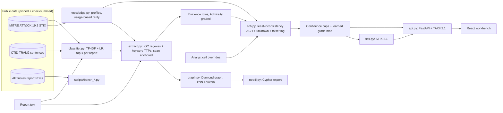

# Architecture

| Module | Role | Extra deps |
| --- | --- | --- |
| `models.py` | Typed contracts: `Evidence`, `ActorProfile`, `Hypothesis`, `Assessment`, `SourceSpan` | none |
| `knowledge.py` | Full ATT&CK STIX loader, per-group profiles, usage statistics | none |
| `extract.py` | Defang-aware IOC regexes, keyword TTP/software matching, merges classifier hits | none |
| `classifier.py` | Sentence-level multi-label TF-IDF + logistic regression, optional per-report top-k | `ml` |
| `ach.py` | Hypotheses, cell rating, diagnosticity, ranking (Heuer or support-aware), confidence caps, sensitivity | none |
| `attribution.py` | `ACHAttributor` and the `SimilarityAttributor` baseline | none |
| `calibration.py` | Learned grade-to-probability map | none |
| `evaluation.py` | Leave-one-report-out benchmark, cross-fitted recalibration | none |
| `graph.py`, `neo4j.py` | Diamond graph, Louvain campaigns, Cypher export | `graph` (Louvain only) |
| `stix.py` | STIX 2.1 export and `stix2` validation | `stix` (validation only) |
| `api.py` | FastAPI service, read-only TAXII 2.1 | `api` |
| `ui/` | React/Vite workbench (live API or static demo) | Node, build time only |

## How the ACH works

1. **Hypotheses.** One per candidate actor, one *false flag: someone framed X* per actor that spoofable markers point at, and *unknown actor* always.
2. **Cells** (CC/C/N/I/II). Techniques used by at least 30% of ATT&CK groups are non-diagnostic; techniques used by at most 3 groups rate CC on a match; parent-only matches are N. Spoofable evidence supports the matching false-flag hypothesis.
3. **Weight** = Admiralty reliability x credibility x relevance x diagnosticity; spoofable rows are halved.
4. **Rank** by least weighted inconsistency (Heuer). Ties go to unknown, then false flag, then a named actor. The opt-in `ranking_rule="balanced"` adds half of the non-spoofable support ([ADR 0007](adr/0007-calibrated-grades-and-support-aware-ranking.md)).
5. **Confidence** from margin and number of diagnostic items, then caps for spoofable support, deception and unknown conclusions. A learned map can turn grades into calibrated probabilities.
6. **What would change this**: a leave-one-out sensitivity pass.

See the [ADRs](adr/index.md) for the reasoning behind each decision.
