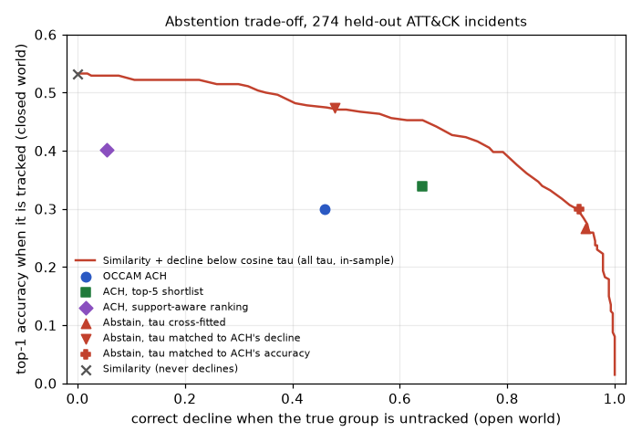

# Evaluation

Every number on this page comes from a script in `scripts/` run on pinned,
checksummed public data. The result files in
[`results/`](https://github.com/rakshit-737/occam/tree/main/results) are
included here verbatim.

**Provenance.** Each table names the GitHub Actions run and the commit that
produced it. All current files come from bench run
[37093689060](https://github.com/rakshit-737/occam/actions/runs/37093689060)
of the manual `bench` workflow. That workflow regenerates every file and lists
any value that differs from the committed one. [Reproduce](reproduce.md) gives
the commands and runtimes.

**Intervals.** All are 95%:

- group-cluster bootstrap where incidents share a group, with paired
  differences computed on the same resamples;
- a Wilson interval with the number of groups as the sample size when a rate
  is exactly 0 or 1 and the bootstrap interval is degenerate (marked †);
- Wilson intervals for the small APTnotes and campaign sets;
- a leave-one-group-out jackknife for clustering scores;
- a document bootstrap for extraction.

A "± SD over folds" describes how much the folds vary, not confidence.

## Summary

**Research question.** Does automated ACH with mandatory disconfirming-evidence
weighting give better-calibrated, less overconfident attribution than naive
TTP-similarity matching, especially under false flags?

**Mostly no.** ACH's remaining advantage is an inspectable matrix with
span-anchored evidence. That is a design property and is not measured here.

- **Calibration.** Under one setting-agnostic calibration map, ACH's pooled
  Brier score is 0.214 [0.202–0.226] and the marker-trusting matcher's is
  0.160 [0.141–0.178]. The paired difference is +0.031 to +0.080, for an equal
  mix of closed, open and planted-marker incidents. ACH is better in the closed
  world (paired −0.178 to −0.075) and worse in the open and planted-marker
  settings.
- **Overconfidence** is a property of the raw outputs. Under planted markers,
  ACH's capped grades are never wrong at stated p ≥ 0.8 (0/274), while the
  matcher's softmax is wrong at that level 194/274 times. After one
  recalibration, neither method makes such errors: 1/822 for ACH, 0/822 for
  the matcher.
- **Planted markers.** Resistance does not depend on ACH's false-flag
  machinery. ACH is still framed only 2.6% of the time without its false-flag
  hypotheses, spoofable discount and caps. It comes from hard evidence
  contradicting the framed group, which both ranking rules honour. Any baseline
  that ignores spoofable rows is never framed, and a consistency gate is
  correct more often.
- **Mimicry.** ACH is framed less often than IDF coverage (27.0% vs 32.1%;
  paired −8.6 to −1.8 points) but is correct less often (17.9% vs 28.8%;
  paired −16.0 to −6.6 points).
- **Abstention.** A cosine-threshold baseline matched to ACH's closed-world
  accuracy declines 93.4% of the time on untracked actors, against ACH's
  46.0%. Matched to ACH's decline rate, it is right 47.4% of the time in the
  closed world, against 29.9%.
- **Costs.** ACH loses closed-world accuracy, and it calls genuine marker
  overlap a frame-up 18.6% of the time.

## 1. False flags: baselines, controls and ablations

Methodology: the 274 leave-one-report-out incidents of section 2, in five
settings:

- *closed*;
- *open*;
- *false_flag*: 3 spoofable markers frame a random other group;
- *authentic*: the same markers point at the true group, a control for false
  alarms;
- *mimicry*: the framed group's 3 rarest techniques or software are added as
  hard evidence.

Baselines include:

- the shipped marker-trusting similarity (marker boost 0.15) and a sweep of
  the boost;
- similarity that ignores spoofable rows;
- IDF coverage;
- an abstaining similarity at three cross-fitted operating points (best
  closed + open accuracy, ACH's decline rate, ACH's closed-world accuracy);
- a consistency gate.

Thresholds are cross-fitted over a 2-fold group split. Each ACH mechanism is
removed one at a time. Calibration uses one map fitted on closed, open and
false-flag incidents together, cross-fitted by group.

--8<-- "results/falseflag.md:3:400"

ACH's operating point lies inside the frontier of the cosine-threshold
baseline (red curve). The curve is in-sample. The marked baseline points are
cross-fitted.

## 2. Sensitivity to the hand-set cell-rule thresholds

Methodology: the same incidents, markers and framing seed. Plain ACH is rerun
with the "common technique" cut-off at 20%, 30% or 40% of groups and the "rare"
cut-off at 2, 3 or 5 groups. A cross-fitted row picks the thresholds on one
group fold and applies them to the other.

--8<-- "results/sensitivity.md:3:400"

## 3. Attribution on held-out ATT&CK group usage

Methodology ([ADR 0004](adr/0004-leave-one-report-out-evaluation.md)): every
(group, cited report) pair with at least 4 techniques/software becomes an
incident (at most 3 per group); items supported only by that report are
removed from the group's profile first. *closed*: the true group is a
candidate; *open*: it is removed and the right answer is to decline;
*false_flag*: 3 spoofable markers frame a random other group.

--8<-- "results/attribution.md:3:400"

## 4. Extended protocols: all reports, campaigns, unattributed, temporal

Methodology:

- `loro-all` drops the per-group cap, giving 575 incidents.
- `campaigns` holds out ATT&CK campaign objects with all their references.
- `unattributed` asks for a decline on campaigns ATT&CK does not attribute.
  `unattributed-clean` drops those whose description names a tracked group.
- `temporal-X` builds profiles from an older ATT&CK release and attributes
  activity added to ATT&CK after it, with renamed technique ids mapped back to
  the old release.

--8<-- "results/attribution_extended.md:3:400"

## 5. Reproduction of published TTP extraction results (rcATT)

Methodology: rcATT's own data (1,490 reports), its label filter, the released
code's 5-fold split and its metrics (Legoy et al., 2020, arXiv:2004.14322v1;
paper numbers from Table 4, "Inde." rows). Four rcATT pipelines form a 2 x 2
ablation of the two settings in which the released code differs from the
paper text: tokenisation, and balanced class weights. OCCAM's classifier
family runs on the same folds.

--8<-- "results/rcatt_reproduction.md:3:400"

## 6. TTP extraction on TRAM2

Methodology: 151 CTI reports, 5-fold cross-validation grouped by document;
classifier thresholds tuned on an inner 20% document split.

--8<-- "results/extraction.md:3:400"

## 7. Campaign clustering

Methodology: per-report slices of ATT&CK group activity plus attributed
campaigns. Hyper-parameters are chosen on dev groups (even ATT&CK numbers) and
reported on disjoint test groups. The test is capability-only, because ATT&CK
records no infrastructure.

--8<-- "results/clustering.md:3:400"

## 8. End-to-end on APTnotes reports

Methodology:

- *Reports.* Public APT report PDFs whose file name or title names exactly one
  ATT&CK group.
- *Pipeline.* Text is extracted, the span-anchored extractor finds techniques
  and software, and the report is attributed against all 176 group profiles.
- *Leak control.* The *leak-controlled* rows first hold out ATT&CK citations
  of the true group that appear to be the same report.

--8<-- "results/aptnotes.md:3:400"

Ablation: which kind of extracted evidence carries the signal?

--8<-- "results/aptnotes_softwareonly.md:3:400"

--8<-- "results/aptnotes_techniquesonly.md:3:400"

With the sentence classifier added (top 10 techniques per report), including a
paired test against the keyword-only run:

--8<-- "results/aptnotes_clf_top10.md:3:400"
