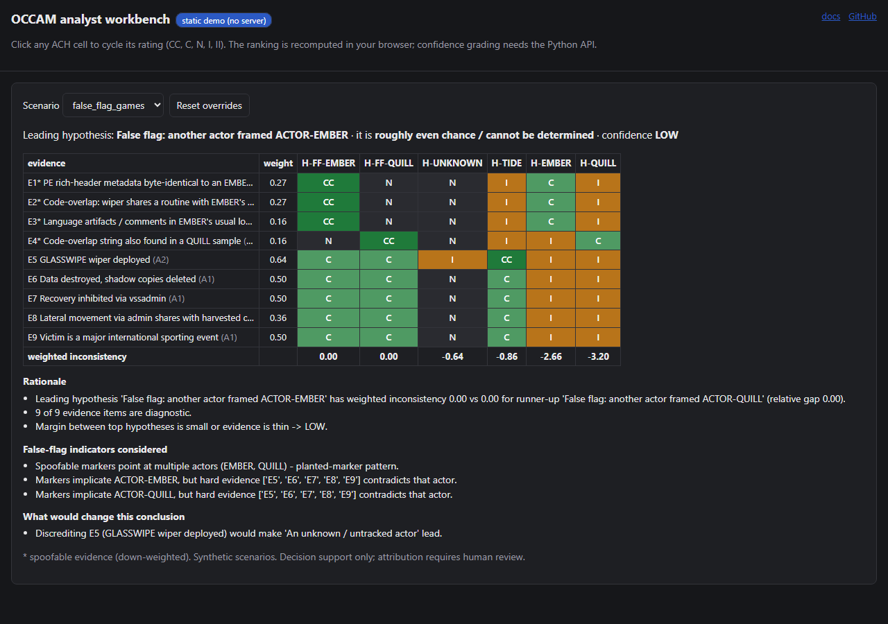

# How it works

This page follows one bundled scenario, `false_flag_games`, from evidence to
conclusion. Every step can be reproduced with

```bash
occam ach false_flag_games          # or: python -m occam ach false_flag_games
```

and explored interactively in the [live workbench demo](https://rakshit-737.github.io/occam-cti-attribution/demo/),
which opens on this scenario.



## 1. Evidence, each with a source and a grade

The scenario has nine evidence rows. Four are **spoofable** (marked `*`):
PE metadata, a shared code routine, language artefacts and a second code
overlap. They are cheap to plant, and three of them point at ACTOR-EMBER,
one at ACTOR-QUILL. Five are **hard** evidence: the GLASSWIPE wiper, data
destruction, recovery inhibition, lateral movement over admin shares and the
victim profile. Every row carries an Admiralty grade (source reliability A-F,
information credibility 1-6), which becomes part of its weight. When evidence
comes from a report, each row also carries the exact text span it was
extracted from (`occam extract`), so a reviewer can check it.

## 2. Hypotheses, including the uncomfortable ones

ACH never only asks "which known actor?". OCCAM always adds an
**unknown / untracked actor** hypothesis and, for every actor that a spoofable
marker points at, a **"false flag: someone framed X"** hypothesis. Here that
gives six columns: three actors (TIDE, EMBER, QUILL), two false-flag
hypotheses (framed EMBER, framed QUILL) and unknown.

## 3. The matrix: consistency, not similarity

Each cell rates one evidence row against one hypothesis: CC (very
consistent), C, N (neutral), I (inconsistent) or II. The rules propose the
cells, and an analyst can override any of them (click a cell in the
workbench, or `--override E5:H-TIDE=I`):

- A planted marker pointing at EMBER is C for "EMBER did it" but **CC** for
  "someone framed EMBER", because a frame-up predicts exactly that marker.
- Hard evidence that contradicts EMBER (EMBER never used GLASSWIPE) is **I**
  for EMBER and **C** for "someone framed EMBER".
- A technique used by most ATT&CK groups is N everywhere and so carries no
  weight. On real data, "common" and "rare" are measured from ATT&CK usage.

## 4. Diagnosticity weights

A row's weight is reliability x credibility x relevance x **diagnosticity**,
where diagnosticity is the spread of its ratings across hypotheses. A row
that rates every hypothesis the same weighs 0, as in Heuer's method. Spoofable
rows are additionally multiplied by 0.5. In the screenshot the GLASSWIPE row
weighs 0.64 and the planted metadata row 0.27.

## 5. Ranking by least inconsistency

Hypotheses are ranked by how much weighted evidence **contradicts** them, not
by how much supports them. Here both false-flag hypotheses have
inconsistency 0.00, unknown -0.64, TIDE -0.86, EMBER -2.66 and QUILL -3.20.
Ties go to the more conservative conclusion (unknown, then false flag, then a
named actor). The leading conclusion is "false flag: another actor framed
ACTOR-EMBER", and the actor the markers point at is ranked near the bottom.

## 6. Confidence that is allowed to go down

The grade starts from the margin over the runner-up and the number of
diagnostic rows, then caps apply:

- LOW if most of the leader's support is spoofable;
- at most MODERATE for deception or unknown conclusions, when a same-actor
  false flag is not decisively rejected, or when planted-marker indicators
  fire (markers point at several actors, or hard evidence contradicts the
  actor they implicate).

Here the two false-flag hypotheses tie, so the result is **LOW**: it is
"roughly even chance" who was framed, and the tool says so.

## 7. What would change the conclusion

A leave-one-out pass reports which single row, if discredited, would flip the
leader. Here, discrediting E5 (the GLASSWIPE wiper) would make "unknown
actor" lead, so E5 is the row to re-verify first.

## How well does this work on real data?

The [Evaluation](evaluation.md) page measures this machinery on hundreds of
held-out ATT&CK incidents, including the cases where it does **not** help: a
simple baseline that ignores spoofable rows resists planted markers just as
well, ACH costs closed-world accuracy, and it sometimes mistakes genuine
overlap for a frame-up. Under **mimicry**, where
the adversary copies the framed group's rare techniques as hard evidence, it is
framed less often than IDF coverage (27.0% vs 32.1%) but is also correct less
often than IDF coverage (17.9% vs 28.8%), and the ablation does not attribute
that gain to diagnosticity weighting.
